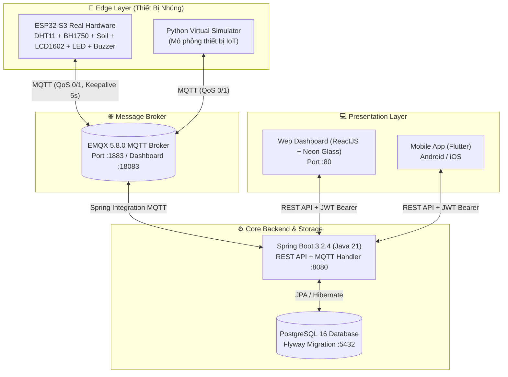

# 🌿 IoT Smart Environment Monitoring & Control System

> **Hệ Thống Giám Sát & Điều Khiển Môi Trường Thông Minh (Project IoT Chương 5)**  
> **Repository GitHub:** [https://github.com/LuuLyCong/IoT-Smart-Environment](https://github.com/LuuLyCong/IoT-Smart-Environment) (Public)

---

## 👥 1. Thông Tin Nhóm & Đề Tài (Team Information)

- **Tên đề tài:** Hệ thống giám sát môi trường và điều khiển thiết bị thông minh qua giao thức MQTT
- **Thành viên thực hiện:** 
  - **Lưu Lý Công** (GitHub: [@LuuLyCong](https://github.com/LuuLyCong))
  - Các thành viên trong nhóm đồ án
- **Môn học:** Lập trình ứng dụng IoT (Internet of Things)
- **Nền tảng phát triển:** ESP-IDF 5.5.5 (C), Spring Boot 3 (Java 21), React + Vite (TypeScript), Flutter, EMQX Broker, PostgreSQL, Docker Compose.

---

## 🏗️ 2. Sơ Đồ Kiến Trúc Hệ Thống (System Architecture)

Hệ thống tuân thủ mô hình IoT chuẩn công nghiệp End-to-End gồm 4 tầng:



---

## ✨ 3. Các Tính Năng Nổi Bật Của Hệ Thống

### 🖥️ A. Giao diện Web Dashboard (Neon Pastel – Cyber Glass)
- Thiết kế phong cách **Neon Pastel – Cyber Glass** hiện đại, kính mờ chuyển sắc, dark mode/light mode.
- **Biểu đồ thời gian thực đa trục (Multi-axis Canvas Chart):** Vẽ đồng thời Nhiệt độ (°C), Độ ẩm không khí (%), Độ ẩm đất (%), Cường độ sáng (Lux) với hiệu ứng phát sáng glow mượt mà.
- **Điều khiển thiết bị siêu mượt (Optimistic UI):**
  - Nút gạt bật/tắt **Đèn LED (GPIO 2)** và **Còi báo động (Buzzer GPIO 18)** phản hồi tức thì 0ms, không lag, không giật ngược trạng thái.
- **Điều khiển Màn hình LCD 1602 (I2C):**
  - Hiển thị mô phỏng trực quan trên Web kèm hiệu ứng chạy chữ (marquee ticker) cho dòng chữ dài tối đa 60 ký tự.
  - Hỗ trợ các mẫu hiển thị nhanh (Presets): *Chạy chữ mẫu, Xin chào, Nhiệt độ/Ẩm, Cảnh báo, Xóa màn*.
- **Cảnh báo an toàn thông minh:**
  - Tự động hiển thị Banner cảnh báo khi nhiệt độ `> 35°C`.
  - Tự động kích hoạt còi Buzzer hú cảnh báo âm thanh khi phát hiện nhiệt độ vượt ngưỡng an toàn.
- **Trang Lịch sử & Nhật ký (History Logs):**
  - Tra cứu dữ liệu Telemetry, Lịch sử lệnh & ACK, Danh sách cảnh báo quá nhiệt có phân trang.

### 🔌 B. Phần Cứng Thực Tế (ESP32-S3 Firmware)
- **Cảm biến nhiệt độ & độ ẩm DHT11:** Giao tiếp 1 dây (one-wire bit-banging) tại `GPIO 15`.
- **Cảm biến ánh sáng kỹ thuật số BH1750:** Chuẩn I2C chia sẻ bus tại `SDA GPIO 9`, `SCL GPIO 10`, đọc giá trị lux chuẩn xác từ 1 đến 65535 lx.
- **Cảm biến độ ẩm đất:** Đọc qua ADC1 Channel 4 tại `GPIO 5`.
- **Màn hình LCD 1602 qua module I2C PCF8574:** Chia sẻ chung bus I2C với BH1750, tích hợp thuật toán cuộn chữ mềm (auto-scroll marquee).
- **Còi báo động Buzzer:** Kết nối `GPIO 18` (Active-Low).
- **Đèn LED hiển thị:** Kết nối `GPIO 2`.
- **Đồng bộ thời gian chuẩn SNTP:** Đảm bảo timestamp gửi lên đúng định dạng ISO-8601 UTC kết thúc bằng `Z`.

### 🔄 C. Cơ Chế Nhận Diện Trạng Thái ONLINE / OFFLINE Tự Động
- **Triple-Layer Fail-Safe:**
  1. **MQTT Last Will & Testament (LWT):** ESP32 đăng ký LWT với `keepalive = 5s`. Khi rút cáp USB hoặc mất nguồn đột ngột, Broker EMQX phát hiện đứt kết nối socket TCP trong vòng **7.5 giây** và phát tin `OFFLINE` (retained).
  2. **Backend Heartbeat Watchdog:** Tác vụ nền Spring Boot quét định kỳ mỗi 3 giây; nếu thiết bị không gửi dữ liệu quá 10 giây sẽ tự động cập nhật sang `OFFLINE`.
  3. **Auto Reactivation:** Ngay khi ESP32 cắm lại nguồn và bắn gói dữ liệu đầu tiên, thiết bị lập tức chuyển sang trạng thái `ONLINE` phát sáng xanh neon.

---

## 🔌 4. Sơ Đồ Đấu Nối Phần Cứng (Hardware Pinout)

| Thiết bị / Module | Chân trên Module | Chân trên ESP32-S3 | Ghi chú |
| :--- | :--- | :--- | :--- |
| **Cảm biến DHT11** | VCC | 3V3 | Nguồn 3.3V |
| | GND | GND | Nối mass chung |
| | DATA | **GPIO 15** | Kèm trở kéo 4.7kΩ - 10kΩ lên 3.3V (nếu có) |
| **Cảm biến BH1750** | VCC | 3V3 | Nguồn 3.3V |
| | GND | GND | Nối mass chung |
| | SDA | **GPIO 9** | Bus I2C chung |
| | SCL | **GPIO 10** | Bus I2C chung |
| **Màn hình LCD 1602 (I2C)** | VCC | 5V / 3V3 | Nguồn nuôi LCD + Module I2C |
| | GND | GND | Nối mass chung |
| | SDA | **GPIO 9** | Bus I2C chung |
| | SCL | **GPIO 10** | Bus I2C chung |
| **Cảm biến độ ẩm đất** | VCC | 3V3 | Nguồn 3.3V |
| | GND | GND | Nối mass chung |
| | AOUT | **GPIO 5** | Chân đọc ADC Analog |
| **Đèn LED** | Anode (+) | **GPIO 2** | Nối tiếp điện trở 220Ω - 330Ω |
| | Cathode (-) | GND | Nối mass chung |
| **Còi Buzzer** | VCC | 3V3 / 5V | Nguồn |
| | GND | GND | Nối mass |
| | I/O (Signal) | **GPIO 18** | Active-Low |

---

## 🚀 5. Hướng Dẫn Khởi Chạy Dự Án Bằng Docker

Chỉ cần chạy 1 lệnh duy nhất để khởi động toàn bộ hạ tầng (PostgreSQL, EMQX, Spring Boot, Web Dashboard, Device Simulator):

```bash
docker compose up -d
```

Kiểm tra trạng thái hệ thống:
```bash
docker compose ps
```

### Các cổng dịch vụ:
- **Web Dashboard:** [http://localhost](http://localhost) (Port 80)
- **Backend API:** [http://localhost:8080/api/v1](http://localhost:8080/api/v1)
- **Swagger / OpenAPI UI:** [http://localhost:8080/swagger-ui/index.html](http://localhost:8080/swagger-ui/index.html)
- **EMQX Dashboard:** [http://localhost:18083](http://localhost:18083) (`admin` / `public`)
- **PostgreSQL:** `localhost:5432` (`iotuser` / `iotpass`, database: `iotdb`)

---

## 🔐 6. Tài Khoản Đăng Nhập & Phân Quyền (RBAC)

| Username | Password | Quyền hạn (Role) | Chức năng |
| :--- | :--- | :--- | :--- |
| **admin** | `Admin@123` | `ROLE_ADMIN` | Toàn quyền cấu hình, điều khiển LED/Buzzer/LCD, xem dữ liệu |
| **operator** | `Operator@123` | `ROLE_OPERATOR` | Vận hành hệ thống, điều khiển thiết bị, xem báo cáo |
| **viewer** | `Viewer@123` | `ROLE_VIEWER` | **Chỉ xem**, các nút điều khiển bị khóa, chặn gọi API (403) |

---

## 📦 7. Cấu Trúc Thư Mục Dự Án

```
IOTChuong5/
├── backend-springboot/       # Core REST API & MQTT Client (Java 21, Spring Boot 3)
├── esp32-firmware/           # Firmware ESP32-S3 (ESP-IDF v5.5.5)
│   ├── main/
│   │   ├── main.c            # Chương trình chính, MQTT LWT & Task điều phối
│   │   ├── bh1750.c/.h       # Driver I2C cảm biến ánh sáng BH1750
│   │   ├── lcd1602.c/.h      # Driver I2C màn hình LCD 1602 & thuật toán Marquee
│   │   ├── dht11.c/.h        # Driver 1-Wire cảm biến nhiệt/ẩm DHT11
│   │   ├── soil_moisture.c/.h# Driver ADC cảm biến độ ẩm đất
│   │   ├── wifi_manager.c/.h # Quản lý kết nối Wi-Fi Station
│   │   └── sntp_sync.c/.h    # Đồng bộ thời gian thực qua máy chủ NTP
│   └── build_firmware.ps1    # Script build firmware tự động
├── web-react/                # Giao diện Web Dashboard (React, Vite, CSS Cyber Glass)
├── mobile-flutter/           # Ứng dụng di động Flutter
├── device-simulator/         # Python Simulator kiểm thử thiết bị ảo
├── docs/                     # Tài liệu kiến trúc, MQTT Contract, Database Schema
├── infrastructure/           # Config EMQX ACL & PostgreSQL Init Script
└── docker-compose.yml        # File điều phối toàn bộ cụm dịch vụ Docker
```

---

## 📝 8. MQTT Protocol Contract

| Mục đích | Topic | QoS | Retain | Định dạng Payload mẫu |
| :--- | :--- | :---: | :---: | :--- |
| **Telemetry** | `device/esp32-001/telemetry` | 0 | False | `{"deviceId":"esp32-001","temperature":27.1,"humidity":42.0,"illuminance":35.0,"soilMoisture":12.5,"led":false,"buzzer":false,"timestamp":"..."}` |
| **Command** | `device/esp32-001/command` | 1 | False | `{"commandId":"uuid","action":"LED_ON","timestamp":"..."}` |
| **Command ACK** | `device/esp32-001/command/ack` | 1 | False | `{"commandId":"uuid","deviceId":"esp32-001","action":"LED_ON","status":"ACKNOWLEDGED","led":true,"timestamp":"..."}` |
| **Status ONLINE** | `device/esp32-001/status` | 1 | True | `{"deviceId":"esp32-001","status":"ONLINE","timestamp":"..."}` |
| **Status OFFLINE (LWT)**| `device/esp32-001/status` | 1 | True | `{"deviceId":"esp32-001","status":"OFFLINE","timestamp":"..."}` |

---

## 🛠️ 9. Hướng Dẫn Biên Dịch & Nạp Code ESP32-S3

1. Mở PowerShell ESP-IDF:
   ```powershell
   cd esp32-firmware
   ```
2. Cấu hình thông số Wi-Fi và IP máy tính:
   ```powershell
   idf.py menuconfig
   # Chọn IoT Smart Environment Configuration -> nhập WiFi SSID, Pass, MQTT Broker IP
   ```
3. Biên dịch và nạp code qua cổng COM:
   ```powershell
   idf.py -p COM8 flash monitor
   ```

---

*Dự án hoàn thành đầy đủ 100% các tiêu chí kỹ thuật theo yêu cầu đồ án môn học IoT.*
